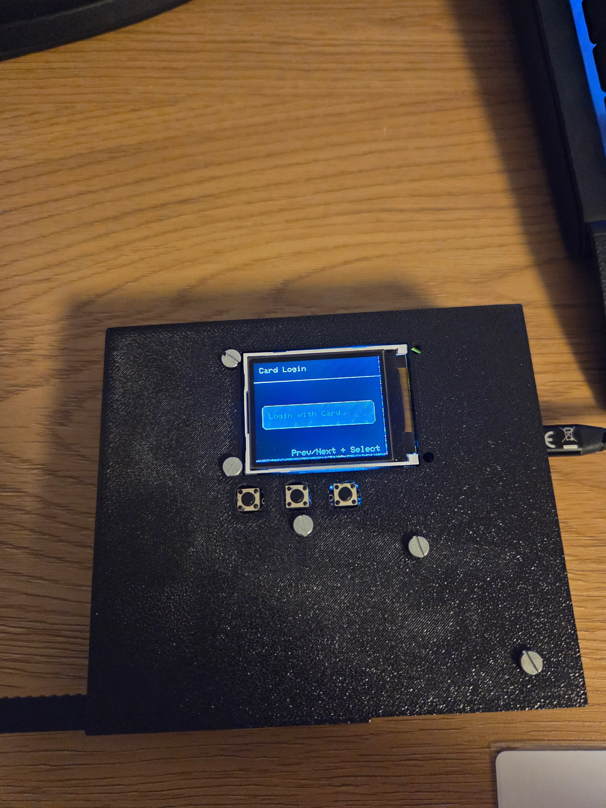
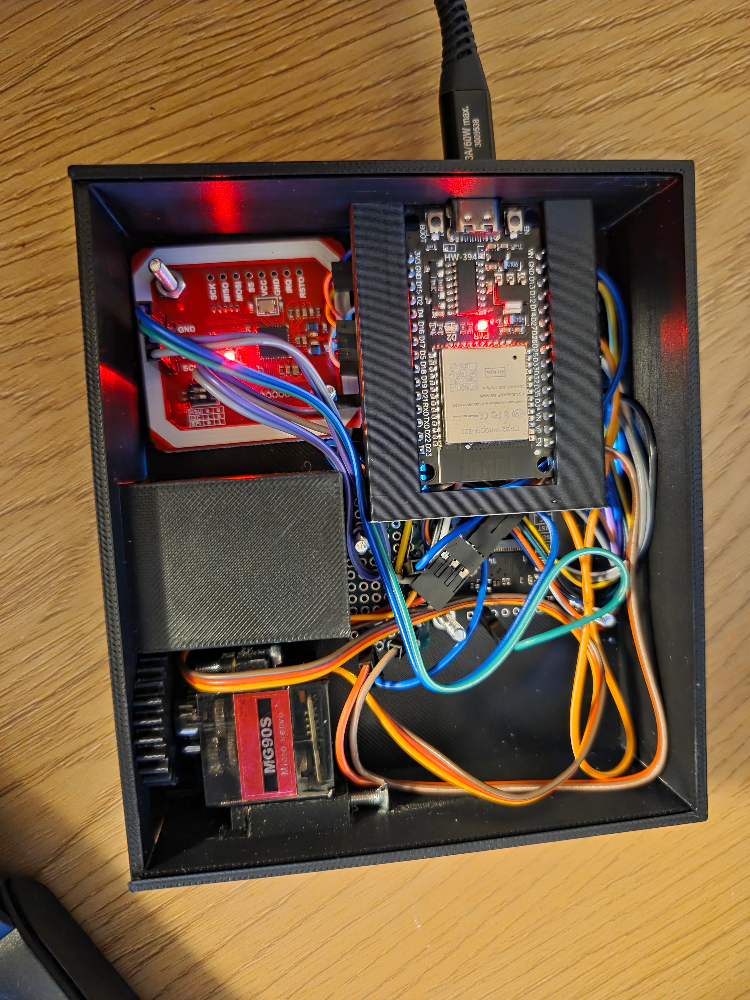
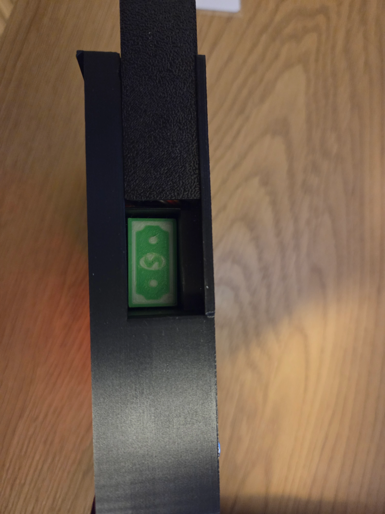

# ESP32 Mock ATM Client

A physical ESP32-based mock ATM prototype built as a personal learning project. The goal was not to create a production-ready ATM system, but to explore embedded development through a hands-on project that connects hardware, software, and a real backend API.

The project connects to [BankingAppJava](https://github.com/Milen714/BankingAppJava), a separate banking backend I was working on for school at the time. Using that backend made this a more relevant way to experiment with API integration, authentication, card-based login, PIN-protected transactions, and physical user interaction.

This repository is mainly a record of the prototype and the things I explored while building it: ESP32 development, TFT displays, NFC cards, web interfaces, authentication flows, 3D modeling, 3D printing, soldering, and servo-controlled mechanisms. It is not intended as a polished product or as a project that someone is expected to clone and reproduce end-to-end.

## Physical Prototype



The ESP ATM prototype with TFT display, 3-button navigation, and card login screen.

### Build Views



Internal layout showing the ESP32, wiring, card hardware, and mounted components.



Side view of the enclosure and card slot area.

### Demo Video

A short physical demo is available at [`images/20260531_031443.mp4`](images/20260531_031443.mp4).

## Prototype Hardware

- **Microcontroller:** ESP32 (ESP-DevKit)
- **Display:** Adafruit ST7735 1.8" TFT LCD (128x160 pixels)
- **Card Reader:** PN532 NFC/RFID module over I2C
  - SDA: GPIO 21
  - SCL: GPIO 22
- **Card:** MIFARE Classic-compatible NFC card/tag
- **Buttons:** 3x Push buttons for navigation
  - Button 1 (GPIO 32): Previous/Up navigation
  - Button 2 (GPIO 33): Next/Down navigation
  - Button 3 (GPIO 26): Select/Confirm action
- **Backlight:** LED (GPIO 25, active LOW)
- **ATM Door Servo:** Micro servo on GPIO 27

## What It Does

- Connects an ESP32 device to the BankingAppJava backend
- Reads login credentials and a PIN from a physical NFC card
- Authenticates users through the backend API
- Shows account selection, balances, transaction amounts, and result screens on a TFT display
- Requires PIN confirmation before submitting a deposit or withdrawal
- Provides a small ESP32-hosted web form for writing a new user and PIN to a card
- Opens a servo-controlled ATM door after a successful transaction

## Running The Prototype

This project depends on the specific hardware build shown above, including the ESP32, TFT display, PN532 NFC reader, buttons, servo mechanism, wiring, and 3D-printed enclosure parts.

If you are browsing the repo, the most relevant configuration points are:

- `src/WiFiConfig.h` for local WiFi credentials
- `src/TransactionApi.cpp` for the backend API URL
- `src/main.cpp` for the main state machine and hardware flow
- `src/webserver.cpp` for the card creation form
- `src/CardReader.cpp` for NFC card read/write behavior

## Usage

### Navigation Flow

1. **Boot:** Device connects to WiFi and shows the card login screen
2. **Card Login:** Press Select and present a programmed NFC card
3. **Account Selection:** Use Prev/Next buttons to navigate through accounts, press Select to choose
4. **Action Selection:** Choose between Deposit or Withdraw
5. **Amount Selection:** Select from predefined amounts (€10, €20, €50, €100)
6. **PIN Entry:** Enter the 4-digit PIN stored on the card before the transaction is submitted
7. **Processing:** Transaction is sent to the API
8. **Result:** Success or failure screen with updated balance; successful transactions open the servo-controlled ATM door briefly

### Card Creation Web Interface

The ESP32 hosts a small web interface at `/` after connecting to WiFi. It shows the current logged-in user and includes a card creation form.

The form posts to `/create-card` with:

- `email`: Banking API login email
- `password`: Banking API login password
- `pin`: 4-digit PIN used to confirm ATM transactions

The submitted data is serialized as JSON and written across multiple MIFARE Classic data blocks on the presented NFC card.

### Button Controls

| Button     | Home/Action     | Amount          | Account               | PIN Entry             | Result      |
| ---------- | --------------- | --------------- | --------------------- | --------------------- | ----------- |
| **Prev**   | Previous option | Previous amount | Previous account page | Decrease selected PIN digit | N/A         |
| **Next**   | Next option     | Next amount     | Next account page     | Increase selected PIN digit | N/A         |
| **Select** | Confirm action  | Confirm amount  | Confirm account       | Advance/submit PIN    | Return home |

## Project Structure

```
ATM-Esp/
├── src/
│   ├── main.cpp              # Main program & state machine
│   ├── display.cpp/h         # TFT display rendering functions
│   ├── WiFiManager.cpp/h     # WiFi connectivity
│   ├── TransactionApi.cpp/h  # API communication (login, transactions, accounts)
│   ├── webserver.cpp/h       # HTTP server and card creation form
│   ├── CardReader.cpp/h      # PN532 card read/write helpers
│   ├── Servo.cpp/h           # Servo-controlled ATM door
│   ├── Button.cpp/h          # Button debouncing logic
│   ├── DisplayColor.h        # Color palette enum (RGB565)
│   ├── WiFiConfig.h          # Local WiFi credentials
│   ├── WiFiConfig.h.Example  # WiFi credential template
│   ├── User.h                # User class (email, PIN, accounts, JWT)
│   └── Account.h             # Account class (IBAN, balance, type)
├── platformio.ini            # PlatformIO configuration
└── README.md                 # This file
```

## Architecture

### State Machine

The application uses a finite state machine to manage the user flow:

- `ActionSelection`: Choose Deposit or Withdraw
- `Amount`: Select transaction amount
- `CardLogin`: Read login credentials and PIN from an NFC card
- `UserSelection`: Select a hardcoded test user during development
- `PinEntry`: Confirm the card PIN before processing a transaction
- `AccountSelection`: Select which account to use
- `Loading`: Processing transaction
- `Result`: Display transaction outcome

### API Integration

Communication with the banking API uses:

- **Auth:** `POST /auth/login` - User authentication (returns JWT)
- **Accounts:** `GET /accounts?ownerId=<id>` - Fetch user's accounts
- **Transactions:** `POST /transactions` - Submit deposit/withdrawal

### Card Data

Cards are written with JSON containing the login email, password, and PIN. This is suitable for the prototype/demo workflow, but real deployments should not store plaintext credentials or PINs on a card.

### Display

- 128x160 pixel TFT display
- Custom button rendering with selection highlighting
- Card login and PIN entry screens
- Real-time account balance display
- Pagination support for multiple accounts

## Configuration

Edit `src/main.cpp` to customize:

- Demo login credentials
- Default account selection
- Transaction amounts

Edit `src/WiFiConfig.h` to customize:

- WiFi SSID
- WiFi password

Edit `src/TransactionApi.cpp` to customize:

- Banking API base URL

---

**Status:** Personal learning prototype  
**Last Updated:** June 22, 2026
